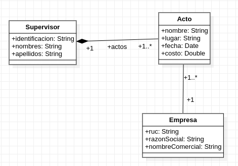

# taller01

* El proceso para la resolución de problemáticas
  * Leer la temática
  * Generar un modelo PIM
  * Generar un modelo PSM
  * Generar código en lenguaje de  programación JAVA

* Para generar el modelo PSM y transformar a lenguaje JAVA, se debe usar la herramienta online https://cruise.umple.org/umpleonline/.

* Una de las problemáticas debe ser probada.

# SOLUCIÓN
## Grupo
- Danny Emanuel Muñoz Flores
- Galo Fernando Medina Rivera

## Problemática
- Se escogió la problemática 2

## PSI Model

## PSM Model

## Código fuente
- Alojado en la carpeta: problematica2/FestivalArtes
- Desarrollo con java
- IDE: Netbeans 13

## Ejecución en consola

