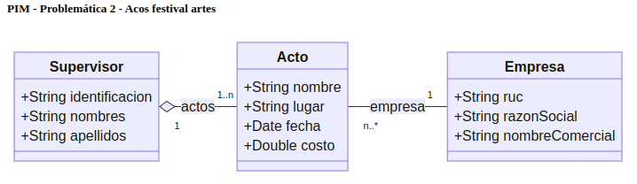
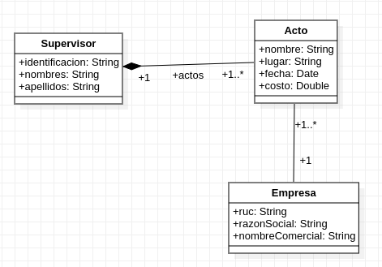
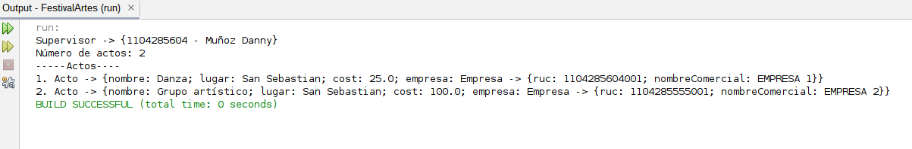

## Problemática

* Para el festival de las Artes de la ciudad de Loja del presente año se necesita un sistema que administre los diversos actos públicos y privados. Un supervisor tendrá a su cargo 1 o muchos actos. Cada acto tendrá un nombre, lugar, fecha, costo total y una empresa que lo respalda.

## PSI Model

## PSM Model

## Código fuente
- Alojado en la carpeta: FestivalArtes
- Desarrollo con java
- IDE: Netbeans 13

## Ejecución en consola

